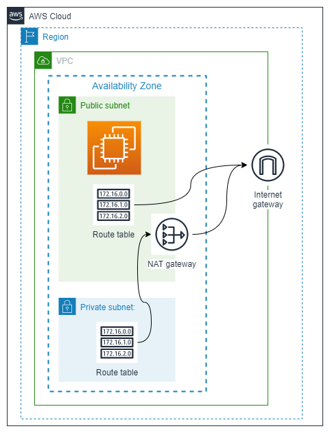
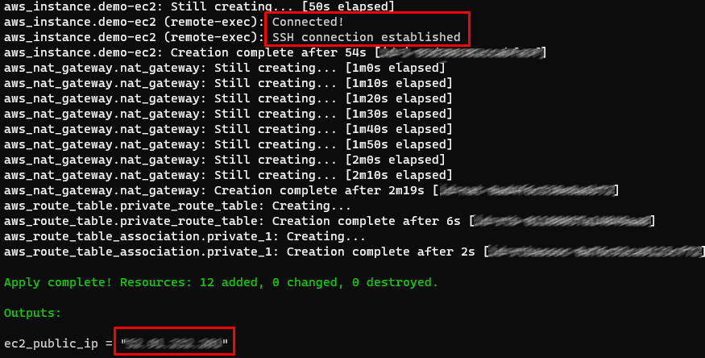

# Classic "Training Course" public EC2 Demo.

Demo of public EC2 running Apache Web Server, very useful to showcase terraform capabilities in a training session.

## Resources deployed by this manifest:

- 1 Public subnet.
- 1 Private subnet.
- 1 Route table per subnet.
- 1 NAT Gateway.
- 1 Internet Gateway.
- 1 Demo "Web Server" Security Group (Allow SSH and HTTP).
- 1 EC2 public instance with Apache and a "Hello World" demo page.
    - Installation and configuration of the Apache web server is handled by a "User Data Script".

### Deployment diagram:



## Tested with: 

| Environment | Application | Version  |
| ----------------- |-----------|---------|
| WSL2 Ubuntu 20.04 | Terraform | v1.0.10 |
| WSL2 Ubuntu 20.04 | AWS-CLI | 2.2.12 |

## Initialization How-To:

Located in the root directory, make an "aws configure" to log into the aws account, and a "terraform init" to download the necessary modules and start the backend.

```bash
aws configure
terraform init
```

## Deployment How-To:

Generate a Key-Pair using AWS-CLI:

```bash
aws ec2 create-key-pair --key-name PublicEC2Demo --query 'KeyMaterial' --output text > PublicEC2Demo.pem
```

>:warning: if you use a different key name, change the variable "key_name" in the variables.tf file

Change permissions:
```bash
chmod 400 PublicEC2Demo.pem
```

Move to home folder:
```bash
mv PublicEC2Demo.pem ~/.ssh/PublicEC2Demo.pem
```

>:warning: if you choose a different location, change the variable "local_ssh_key" in the variables.tf file

## Debugging / Troubleshooting:

### Get the EC2 Public IP:

This manifest output the public IP of EC2, so you just need to copy it:



>:bulb: As you can see from the screenshot above, it also includes an "SSH echo test" confirmation in the output.

### How to connect to the instance via SSH:

If you follow the instructions in this README file, you should be able to connect like this:

```bash
ssh -i ~/.ssh/PublicEC2Demo.pem ec2-user@11.111.111.111
```

## Author:

- [@jmanzur](https://github.com/JManzur)